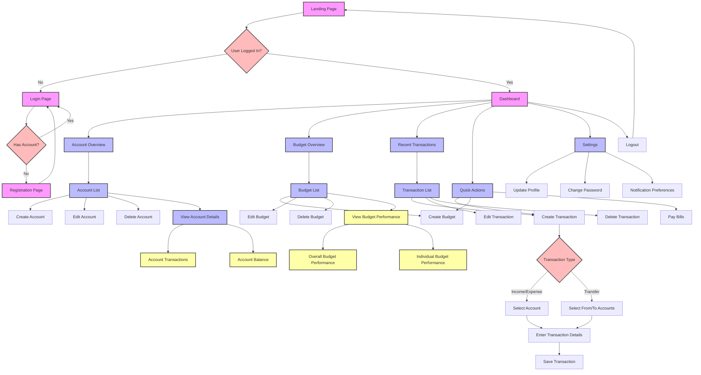

A detailed flow diagram of the application using mermaid syntax. This diagram will illustrate the user journey and the interconnections between different parts of the application.

Here's a detailed flow diagram of the application:

This diagram illustrates:

1. The entry point (Landing Page) and authentication flow.
2. The central Dashboard and its main components.
3. Account management flow, including creation, editing, deletion, and viewing details.
4. Budget management flow, including creation, editing, deletion, and performance viewing.
5. Transaction management flow, including the process for adding different types of transactions.
6. Quick actions available from the Dashboard.
7. Settings and logout options.

The diagram uses different shapes and colors to represent:
- Rectangles with rounded corners (pink): Pages
- Rectangles (light blue): Processes or actions
- Parallelograms (yellow): Data displays
- Diamonds (light red): Decision points

This visual representation helps to understand the overall structure of the application and how different components are interconnected. It shows the various paths a user can take through the system and the actions they can perform at each stage.