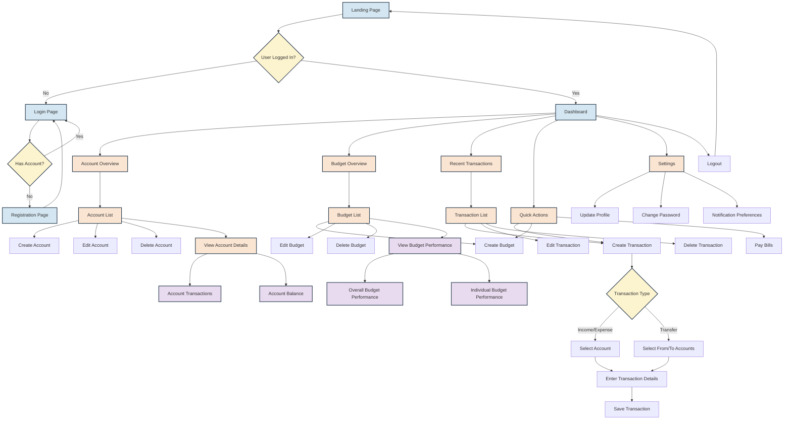

Considering accessibility in the initial color scheme. Adjusted the colors to make them more accessible and easier to see. We'll use a higher contrast color scheme that's more friendly to those with visual impairments.

Here's the updated diagram with a more accessible color scheme:

In this updated version, I've made the following changes to improve accessibility:

1. Pages (previously pink): Now use a light blue (#D4E6F1), which provides good contrast and is easier on the eyes.
2. Processes (previously light blue): Now use a light orange (#FAE5D3), which stands out well against the other colors.
3. Data displays (previously yellow): Now use a light purple (#E8DAEF), providing a distinct look for data-related nodes.
4. Decision points (previously light red): Now use a light yellow (#FCF3CF), making decision points clear without being too harsh.
5. All node borders and text: Now use a dark blue-gray (#2C3E50), providing high contrast against all background colors.

These colors were chosen to:

- Provide sufficient contrast between the text and background
- Be distinguishable from each other, even for those with color vision deficiencies
- Avoid very bright or saturated colors that can cause eye strain
- Maintain a professional and cohesive look for the diagram

The structure and content of the diagram remain the same, ensuring that it still provides a comprehensive view of the application flow. The new color scheme should make it easier for all users to read and understand the diagram, regardless of their visual capabilities.
