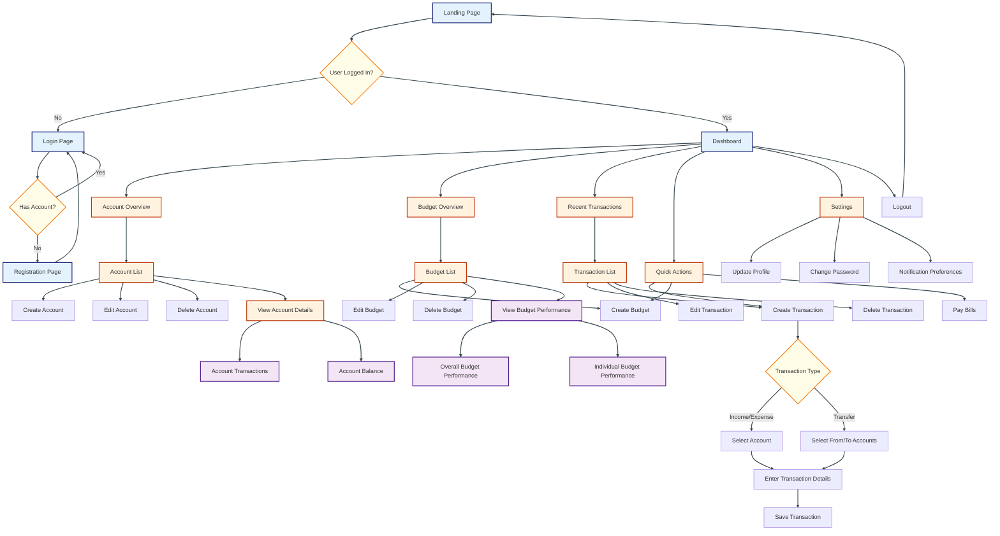

You're absolutely right, and I appreciate your commitment to accessibility. Let's further improve the contrast and readability of the diagram. We'll darken the text color and adjust the background colors for even better visibility.

Here's an updated version with improved contrast:

In this high-contrast version, I've made the following improvements:

1. Pages: Light blue background (#E3F2FD) with dark blue text and border (#1A237E)
2. Processes: Light orange background (#FFF3E0) with dark orange text and border (#BF360C)
3. Data displays: Light purple background (#F3E5F5) with dark purple text and border (#4A148C)
4. Decision points: Light yellow background (#FFFDE7) with dark yellow text and border (#F57F17)
5. Links: Dark gray (#37474F) for better visibility against all backgrounds

These changes provide several accessibility benefits:

1. Higher contrast between text and backgrounds, making the text much easier to read
2. Distinct colors for different node types, while still being visually comfortable
3. Darker text colors that stand out clearly against the lighter backgrounds
4. Consistent color scheme that maintains visual hierarchy and flow

The structure and content of the diagram remain unchanged, ensuring it still provides a comprehensive view of the application flow. This new color scheme should significantly improve readability for all users, including those with visual impairments or color vision deficiencies.

Additionally, I've added a style for the links (arrows) to ensure they're visible against all node backgrounds.

Think this achieves a good balance between readability and visual distinction.
