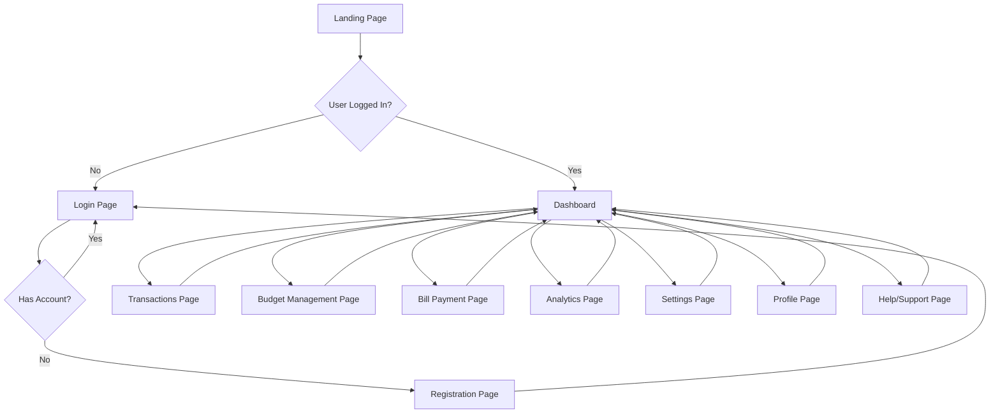

Let's carefully review and plan out the pages and user flow for our financial dashboard application. We'll ensure we're using all the components and features we've developed so far.

Let's start by outlining the pages and then create a user flow diagram.

Pages we should have:

1. Landing Page
2. Login Page
3. Registration Page
4. Dashboard (Main page after login)
5. Transactions Page
6. Budget Management Page
7. Bill Payment Page
8. Analytics Page
9. Settings Page
10. Profile Page
11. Help/Support Page

Now, let's create a user flow diagram:

Now, let's detail the user journey and how we'll incorporate our developed components and features:

1. Landing Page:
   - Brief overview of the app's features
   - Call-to-action buttons for Login and Sign Up

2. Login Page:
   - Use our authentication system
   - Implement error handling for failed logins

3. Registration Page:
   - Multi-step form wizard for user registration
   - Form validation using our custom hooks

4. Dashboard (Main page after login):
   - Display current balance
   - Show recent transactions
   - Budget overview
   - Upcoming bills
   - Quick access to main features
   - Implement the replay feature for recent financial events

5. Transactions Page:
   - List of all transactions
   - Filtering and sorting options
   - Use our file upload component for importing transactions
   - Implement side drawer for transaction details

6. Budget Management Page:
   - Display current budgets
   - Allow creating, editing, and deleting budget buckets
   - Visualize budget vs. actual spending

7. Bill Payment Page:
   - List of upcoming and past bills
   - Payment scheduling
   - Payment history

8. Analytics Page:
   - Charts and graphs showing financial trends
   - Use our OpenTelemetry setup for detailed metrics

9. Settings Page:
   - Account settings
   - Notification preferences
   - Connected accounts

10. Profile Page:
    - User information
    - Activity log (using our event sourcing feature)

11. Help/Support Page:
    - FAQs
    - Contact form (using our form wizard component)

User Flow and Feature Integration:

1. User lands on the Landing Page and clicks "Login"
2. User authenticates on the Login Page
3. Upon successful login, user is directed to the Dashboard
4. On the Dashboard:
   - Recent transactions are displayed with the option to replay events
   - Budget overview is shown using our bucket management component
   - Upcoming bills are listed
5. User can navigate to other pages from the Dashboard:
   - Transactions Page: Uses our file upload component for importing transactions
   - Budget Management Page: Utilizes our bucket management feature
   - Analytics Page: Displays charts using our analytics component
6. Throughout the app:
   - Side drawers are used for detailed views and quick edits
   - Error handling and notifications are managed by our global error system
   - Forms use our custom hooks for state management and validation
   - The replay feature is available where relevant (e.g., on the Dashboard and Transactions pages)
   - Background jobs (like transaction imports or report generation) are managed and displayed using our background jobs component

This flow ensures that we're utilizing all the components and features we've developed, providing a comprehensive and user-friendly financial management experience.

To further improve the user experience, we could implement:

1. Onboarding tutorial using our replay feature to guide new users
2. Quick action buttons on the Dashboard for common tasks
3. Notifications for important events (low balance, bill due, etc.)
4. Mobile responsiveness for all pages

By following this flow and integrating our developed features, we create a cohesive, feature-rich application that guides users through their financial management tasks effectively.